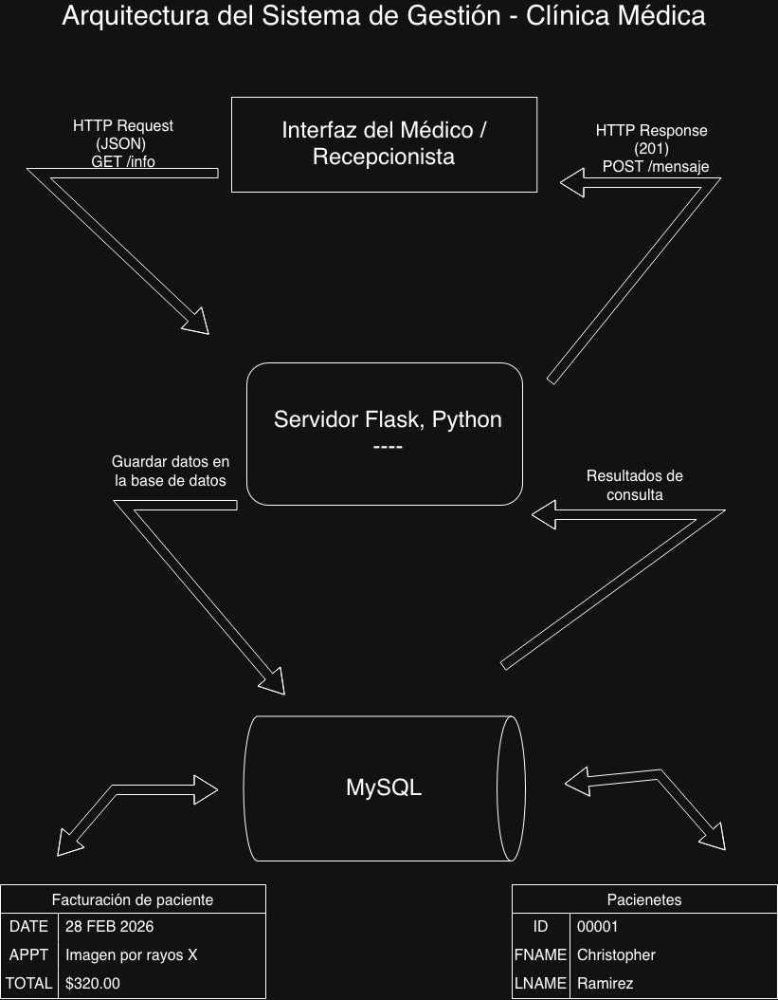

# Sistema de Gestión - Clínica Médica 🏥
Este es el proyecto Capstone para la gestión de pacientes y citas

## Funcionalidades
* **API Flask:** Manejo de rutas para consultar y registrar información.
* **Arquitectura:** Estructura de tres capas (Cliente, Servidor, Base de Datos/MySQL)

## Rutas Principales
* `GET /info`: Verifica el estado del servidor
* `POST /mensaje`: Registra nuevos datos en el sistema

## Diagrama de Arquitectura

## Base de Datos
El sistema utiliza **MySQL** para el almacenamiento persistente de registros médicos.